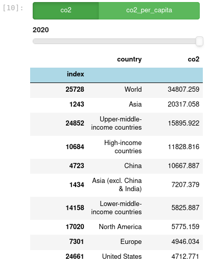
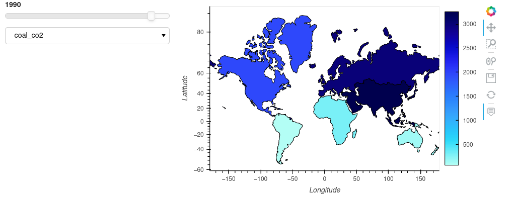
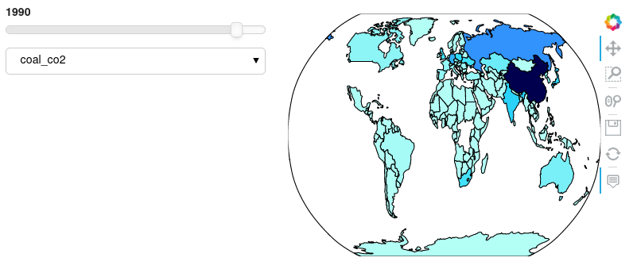

# holoviz-examples

An area for my howto guides on working with holoviz libraries.

**button and slider filter for dataframe** - Presents a top 10 table selecting rows using the slider widget and columns using the button widget in hvPlot.

**Geoviews country and continent example** - first example is an interactive geoViews world map showing data for each country. the second is an interactive hvPlot map for the continents. Uses geopandas geometry data for both.

